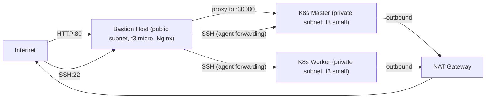

# Private Infrastructure Setup Guide

## Architecture Overview



### Components

| Component | Subnet | Purpose |
|-----------|--------|---------|
| Bastion Host (t3.micro) | Public | SSH jump host + Nginx reverse proxy |
| K8s Master (t3.small) | Private | Kubernetes control plane |
| K8s Worker (t3.small) | Private | Kubernetes workloads |
| NAT Gateway | Public | Outbound internet for private nodes |

### Networking

- **VPC CIDR**: `10.0.0.0/16`
- **Public subnets**: `10.0.1.0/24` (us-east-1a), `10.0.2.0/24` (us-east-1b)
- **Private subnets**: `10.0.101.0/24` (us-east-1a), `10.0.102.0/24` (us-east-1b)
- **NAT Gateway**: Single, shared across both private subnets

### Security Groups

| Security Group | Inbound Rules | Applies To |
|---------------|---------------|------------|
| bastion | SSH (22) from `0.0.0.0/0`, HTTP (80) from `0.0.0.0/0`, NodePort (30000-32767) from `0.0.0.0/0` | Bastion |
| k8s_common | SSH (22) from bastion SG, NodePort (30000-32767) from bastion SG, all traffic from self | Master, Worker |
| k8s_master | K8s API (6443) from bastion SG | Master |

All security groups allow all outbound traffic.

---

## Deployment Steps

### Prerequisites

- AWS CLI configured with valid credentials
- Terraform >= 1.3.0
- Packer >= 1.8.0
- Ansible >= 2.12
- An AWS key pair created in the target region

### Step 1: Build the AMI with Packer

Packer bakes an Ubuntu 22.04 AMI with NTP (chrony) and Kubernetes dependencies (containerd, kubeadm, kubelet, kubectl) pre-installed. This speeds up subsequent deployments.

```bash
cd packer
packer init k8s-node.pkr.hcl
packer build k8s-node.pkr.hcl
```

Packer launches a temporary EC2 instance, runs the Ansible `packer-playbook.yml` (which applies the `ntp` and `kubernetes` roles), then creates an AMI snapshot.

Note the AMI ID from the output (e.g., `ami-0abc123def456...`).

### Step 2: Provision Infrastructure with Terraform

```bash
cd terraform/private
terraform init
terraform apply -var key_name=<your-key-name> -var ami_id=<packer-ami-id>
```

This creates:
- A custom VPC with public and private subnets
- A NAT Gateway in the public subnet
- A bastion host (t3.micro) in the public subnet
- A K8s master (t3.small) in private subnet (us-east-1a)
- A K8s worker (t3.small) in private subnet (us-east-1b)
- Security groups restricting access through the bastion

Note the 3 outputs:
```
bastion_public_ip  = "x.x.x.x"
master_private_ip  = "10.0.101.x"
worker_private_ip  = "10.0.102.x"
```

### Step 3: Update Ansible Inventory

Edit `ansible/inventory/hosts.ini` with the real IPs from Step 2:

```ini
[bastion]
<bastion_public_ip>

[master]
<master_private_ip>

[workers]
<worker_private_ip>

[k8s:children]
master
workers

[bastion:vars]
ansible_user=ubuntu
ansible_ssh_private_key_file=~/.ssh/your-key.pem
ansible_ssh_common_args=-o StrictHostKeyChecking=no

[k8s:vars]
ansible_user=ubuntu
ansible_ssh_private_key_file=~/.ssh/your-key.pem
ansible_ssh_common_args=-o StrictHostKeyChecking=no -o ProxyCommand="ssh -W %h:%p -i ~/.ssh/your-key.pem ubuntu@<bastion_public_ip>"
master_private_ip=<master_private_ip>
```

Replace all `<bastion_public_ip>`, `<master_private_ip>`, and `<worker_private_ip>` placeholders with actual IPs. Also replace `your-key.pem` with your actual key filename.

The `ProxyCommand` in `[k8s:vars]` tunnels all SSH connections to private nodes through the bastion.

### Step 4: Run the Ansible Playbook

```bash
ansible-playbook -i ansible/inventory/hosts.ini ansible/playbook.yml
```

The playbook runs 4 plays in order:

1. **Bastion**: Installs and starts Nginx
2. **All K8s nodes**: Installs NTP and Kubernetes dependencies (skipped quickly if Packer AMI was used since they're already installed)
3. **Master**: Initializes the Kubernetes cluster with `kubeadm init`, installs Flannel CNI, generates the worker join command
4. **Workers**: Joins the worker to the cluster using the join command from the master

### Step 5: Copy K8s Manifests to Master

From your local machine (with ssh-agent loaded):

```bash
eval $(ssh-agent)
ssh-add ~/.ssh/your-key.pem

scp -r -o ProxyCommand="ssh -A -W %h:%p ubuntu@<bastion_ip>" \
  k8s/ ubuntu@<master_private_ip>:~/k8s/
```

### Step 6: Deploy the Application

SSH into the master via the bastion:

```bash
ssh -A -i ~/.ssh/your-key.pem ubuntu@<bastion_ip>
ssh ubuntu@<master_private_ip>
```

Deploy the app:

```bash
kubectl apply -k ~/k8s/overlays/dev/
```

Verify everything is running:

```bash
kubectl get pods -n devops-practical
kubectl get svc -n devops-practical
```

### Step 7: Configure Nginx on Bastion

SSH into the bastion:

```bash
ssh -A -i ~/.ssh/your-key.pem ubuntu@<bastion_ip>
```

Edit the Nginx config:

```bash
sudo nano /etc/nginx/sites-available/default
```

Replace the contents with:

```nginx
server {
    listen 80;
    server_name _;

    location / {
        proxy_pass http://<master_private_ip>:30000;
        proxy_set_header Host $host;
        proxy_set_header X-Real-IP $remote_addr;
        proxy_set_header X-Forwarded-For $proxy_add_x_forwarded_for;
    }
}
```

Test and reload:

```bash
sudo nginx -t
sudo systemctl reload nginx
```

### Step 8: Access the Application

Open `http://<bastion_public_ip>` in your browser.

---

## SSH Access Reference

### SSH to bastion (direct)

```bash
ssh -i ~/.ssh/your-key.pem ubuntu@<bastion_public_ip>
```

### SSH to master/worker via bastion (agent forwarding)

```bash
eval $(ssh-agent)
ssh-add ~/.ssh/your-key.pem
ssh -A ubuntu@<bastion_public_ip>
# Then from bastion:
ssh ubuntu@<master_private_ip>
```

### SCP files to master via bastion

```bash
scp -r -o ProxyCommand="ssh -A -W %h:%p ubuntu@<bastion_ip>" \
  <local_path> ubuntu@<master_private_ip>:<remote_path>
```

---

## How Traffic Flows

### Inbound (user to app)

```
Browser -> http://<bastion_public_ip>:80
  -> Bastion Nginx (proxy_pass)
    -> Master NodePort :30000
      -> App Pod
```

### Outbound (nodes to internet)

```
Private Node -> Private Route Table (0.0.0.0/0 -> NAT GW)
  -> NAT Gateway (in public subnet)
    -> Internet Gateway
      -> Internet
```

The NAT Gateway translates private IPs to its own Elastic IP for outbound requests and routes responses back.

### SSH access (Ansible / manual)

```
Local Machine -> SSH to Bastion (public IP, port 22)
  -> ProxyCommand / Agent Forwarding
    -> SSH to Private Node (private IP, port 22)
```

---

## File Structure

```
terraform/
  private/
    main.tf              # VPC module (public/private subnets, NAT GW)
    ec2.tf               # Bastion, master, worker instances
    security-groups.tf   # Bastion SG, k8s_common SG, k8s_master SG
    variables.tf         # aws_region, cluster_name, instance_type, key_name, ami_id, vpc_cidr
    outputs.tf           # bastion_public_ip, master_private_ip, worker_private_ip
  public/                # Original config (nodes in default VPC with public IPs)

ansible/
  playbook.yml           # Full playbook (bastion + k8s setup)
  packer-playbook.yml    # Subset for Packer AMI builds
  inventory/hosts.ini    # Inventory with bastion proxy config
  roles/
    bastion/tasks/        # Nginx install
    ntp/tasks/            # Chrony install
    kubernetes/tasks/     # containerd + kubeadm + kubelet + kubectl
    master/tasks/         # kubeadm init + Flannel CNI + join command
    worker/tasks/         # kubeadm join

packer/
  k8s-node.pkr.hcl      # Bakes AMI with NTP + K8s deps

k8s/
  base/                  # Kustomize base (app + mongo manifests)
  overlays/dev/          # Dev overlay
  overlays/prod/         # Prod overlay
```

---

## Teardown

To destroy all AWS resources:

```bash
cd terraform/private
terraform destroy -var key_name=<your-key-name> -var ami_id=<your-ami-id>
```

To also deregister the Packer AMI, go to AWS Console > EC2 > AMIs and deregister it manually, then delete the associated snapshot.

